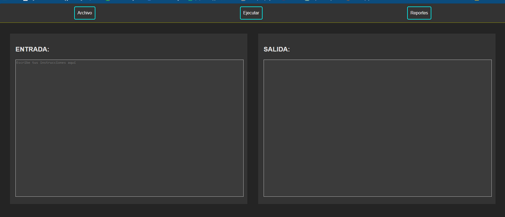
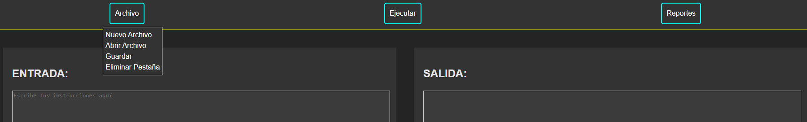
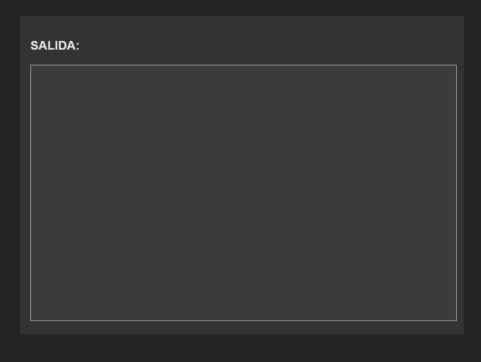
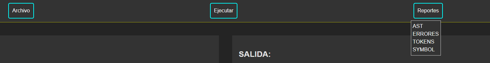
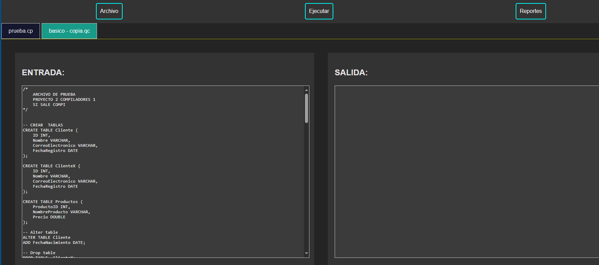
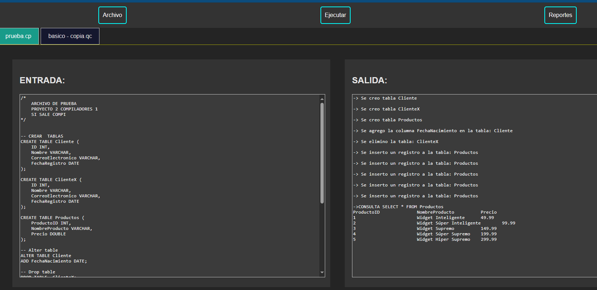
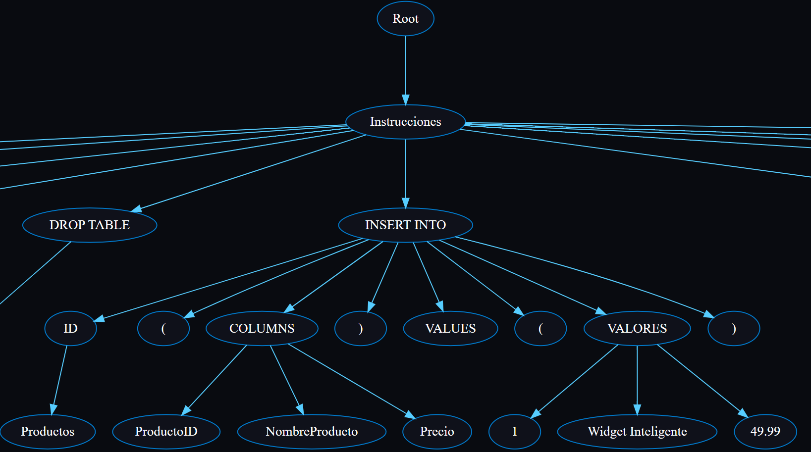
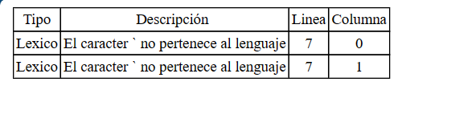

# **Proyecto 2**
### Universidad de San Carlos de Guatemala
### Facultad de Ingeniería
### Escuela de Ciencias y Sistemas
### Organización de Lenguajes y Compiladores 1
### Sección C
| Nombre | Carnet | 
| --- | --- |
| Jhonatan Alexander Aguilar Reyes  | 202106003 |
----
# **Manual de Usuario**

## **Descripción General**
El proyecto consiste en el desarrollo de un interprete para el lenguaje de programación **QueryCrypter**. El interprete es capaz de leer un archivo de texto con extensión **.cp** y ejecutarlo. El interprete es capaz de ejecutar instrucciones y expresiones de un lenguaje nativo, tales como:
- Creacion de tablas 
- Inserccion de datos a tablas
- Consultas a las tablas
- Actualizacion de tablas
- Eliminacion de tablas
- Declaración de variables
- Asignación de variables
- Operaciones aritméticas
- Operaciones lógicas
- Operaciones relacionales
- Estructuras de control
- Funciones
- Instrucciones ciclicas
- Instrucciones de salto
- Instrucciones de entrada y salida
- Instrucciones de llamada a función
- Instrucciones de retorno de función
- Instrucciones de declaración de función

Es capaz de generar una salida con la tipica consola, ademas de reportes de errores, tabla de símbolos y gráfica de un árbol AST.

## **Requerimientos**
Un navegador web para visualizar, ejecutar y editar el código fuente del proyecto. Se recomienda utilizar el navegador Google Chrome.

## **Lenguaje**
Al ser un interprete para el lenguaje **QueryCrypter**, se debe utilizar la sintaxis del lenguaje SQL para poder ejecutar el código. La sintaxis del lenguaje.

**Ejemplo de código:**
```SQL
// Declaración de variables
/*
    ARCHIVO DE PRUEBA
    PROYECTO 2 COMPILADORES 1
    SI SALE COMPI
*/


-- CREAR  TABLAS
CREATE TABLE Cliente (
    ID INT,
    Nombre VARCHAR,
    CorreoElectronico VARCHAR,
    FechaRegistro DATE
);

CREATE TABLE ClienteX (
    ID INT,
    Nombre VARCHAR,
    CorreoElectronico VARCHAR,
    FechaRegistro DATE
);

CREATE TABLE Productos (
    ProductoID INT,
    NombreProducto VARCHAR,
    Precio DOUBLE
);

-- Alter table
ALTER TABLE Cliente
ADD FechaNacimiento DATE;

-- Drop table
DROP TABLE  ClienteX;

-- Insertar datos en la tabal cliente
INSERT INTO Cliente (ID, Nombre, CorreoElectronico, FechaRegistro, FechaNacimiento)
VALUES (1, "Ana García", "ana@example.com", '2023-04-10', '1985-08-20');
INSERT INTO Clientes (ClienteID, NombreCliente, CorreoElectronico, FechaRegistro, FechaNacimiento)
VALUES (2, "Pedro López", "pedro@example.com", '2023-04-12', '1990-11-15');
INSERT INTO Clientes (ClienteID, NombreCliente, CorreoElectronico, FechaRegistro, FechaNacimiento)
VALUES (3, "Luisa Rodríguez", "luisa@example.com", '2023-04-14', '1982-03-25');
INSERT INTO Clientes (ClienteID, NombreCliente, CorreoElectronico, FechaRegistro, FechaNacimiento)
VALUES (4, "Carlos Sánchez", "carlos@example.com", '2023-04-16', '1995-09-03');
INSERT INTO Clientes (ClienteID, NombreCliente, CorreoElectronico, FechaRegistro, FechaNacimiento)
VALUES (5, "Isabel Martínez", "isabel@example.com", '2023-04-18', '1987-06-12');


-- Insertar datos en la tabal productos
INSERT INTO Productos (ProductoID, NombreProducto, Precio)
VALUES (1, "Widget Inteligente", 49.99),
INSERT INTO Productos (ProductoID, NombreProducto, Precio)
VALUES (2, "Widget Súper Inteligente", 99.99),
INSERT INTO Productos (ProductoID, NombreProducto, Precio)
VALUES (3, "Widget Supremo", 149.99);
INSERT INTO Productos (ProductoID, NombreProducto, Precio)
VALUES (4, "Widget Súper Supremo", 199.99);
INSERT INTO Productos (ProductoID, NombreProducto, Precio)
VALUES (5, "Widget Hiper Supremo", 299.99);

       

-- Seleccionar datos
SELECT * FROM Cliente;
/*
+-----------+-----------------+---------------------+----------------+------------------+
| ClienteID | NombreCliente   | CorreoElectronico  | FechaRegistro  | FechaNacimiento  |
+-----------+-----------------+---------------------+----------------+------------------+
| 1         | Ana García      | ana@example.com    | 2023-04-10     | 1985-08-20       |
| 2         | Pedro López     | pedro@example.com  | 2023-04-12     | 1990-11-15       |
| 3         | Luisa Rodríguez | luisa@example.com  | 2023-04-14     | 1982-03-25       |
| 4         | Carlos Sánchez  | carlos@example.com | 2023-04-16     | 1995-09-03       |
| 5         | Isabel Martínez | isabel@example.com | 2023-04-18     | 1987-06-12       |
+-----------+-----------------+---------------------+----------------+------------------+
*/

-- Actualizar datos
UPDATE Cliente
SET CorreoElectronico = "anaGar@example.com"
WHERE ID = 1;
SELECT * FROM Cliente WHERE ID = 1;
/*
+-----------+-----------------+--------------------+----------------+------------------+
| ClienteID | NombreCliente   | CorreoElectronico  | FechaRegistro  | FechaNacimiento  |
+-----------+-----------------+--------------------+----------------+------------------+
| 1         | Ana García      | anaGar@example.com | 2023-04-10     | 1985-08-20       |
+-----------+-----------------+--------------------+----------------+------------------+
*/

-- seleccionar datos
SELECT * FROM Productos;
/*
+-----------+--------------------------+--------+
| ProductoID | NombreProducto          | Precio |
+-----------+--------------------------+--------+
| 1         | Widget Inteligente       | 49.99  |
| 2         | Widget Súper Inteligente | 99.99  |
| 3         | Widget Supremo           | 149.99 |
| 4         | Widget Súper Supremo     | 199.99 |
| 5         | Widget Hiper Supremo     | 299.99 |
+-----------+--------------------------+--------+
*/

-- Truncar tabla
TRUNCATE  TABLE Productos;
SELECT * FROM Productos;
/*
+-----------+--------------------------+--------+
| ProductoID | NombreProducto          | Precio |
+-----------+--------------------------+--------+
*/

-- Borrar datos
DELETE FROM Cliente WHERE FechaRegistro = '2023-04-16';

SELECT * FROM Cliente;
/*
+-----------+-----------------+---------------------+----------------+------------------+
| ClienteID | NombreCliente   | CorreoElectronico  | FechaRegistro  | FechaNacimiento  |
+-----------+-----------------+---------------------+----------------+------------------+
| 1         | Ana García      | ana@example.com    | 2023-04-10     | 1985-08-20       |
| 2         | Pedro López     | pedro@example.com  | 2023-04-12     | 1990-11-15       |
| 3         | Luisa Rodríguez | luisa@example.com  | 2023-04-14     | 1982-03-25       |
| 5         | Isabel Martínez | isabel@example.com | 2023-04-18     | 1987-06-12       |
+-----------+-----------------+---------------------+----------------+------------------+
*/

-- Bloque condicional
BEGIN
    DECLARE @edad INT DEFAULT 25;
    DECLARE @puntosTalent INT DEFAULT 90;
    DECLARE @resultadoTalent VARCHAR;

    IF @edad > 18 AND @puntosTalent >= 80 THEN
    BEGIN
        SET @resultadoTalent = "Talent Plus";
    END;
    
    IF @edad > 18 AND @puntosTalent < 80 THEN
    BEGIN
        SET @resultadoTalent = "Talent";
    END;

    IF @edad  = 10 THEN
        PRINT "La edad es 10";
    ELSE
        PRINT @edad;
    END IF;
    PRINT "El resultado es (PRINT):";
    PRINT @resultadoTalent;
    SELECT "El resultado es (SELECT):";
    SELECT @resultadoTalent;
END;

-- Bloque de bucle while
BEGIN
    DECLARE @contador INT DEFAULT 1;
    DECLARE @suma INT DEFAULT 0;

    WHILE @contador <= 20
    BEGIN
        IF @contador % 3 = 0 THEN
        BEGIN
            SET @suma = @suma + @contador;
        END;
        SET @contador = @contador + 1;
    END;

    PRINT "La suma de los múltiplos de 3 del 1 al 20 es: " + CAST(@suma AS VARCHAR);
END;
-- Funciones nativas
SELECT LOWER("Hola, Mundo"); -- hola, mundo
SELECT UPPER("hola, mundo"); -- HOLA, MUNDO
SELECT ROUND(123.456789, 2); -- 123.46
SELECT LEN("¡Esto es un texto creativo y largo!"); -- 31 caracteres
SELECT TRUNCATE(8.965, 1); -- 8.9
SELECT TYPEOF("Hola"); -- VARCHAR

```
## **Pagina Web**

Al abrir en el navegador el link del proyecto, se mostrara la siguiente pagina web:


## **Editor de Código**
En la parte del centro de la pagina web se encuentra el editor de código, donde se puede escribir el código fuente del programa a ejecutar. El editor de código cuenta con las siguientes funcionalidades:



- **Guardar:** Permite guardar el código fuente en un archivo con extensión **.tw**.
- **Abrir archivo:** Permite abrir un archivo con extensión **.tw** y cargar el código fuente en el editor de código.
- **Ejecutar código:** Permite ejecutar el código fuente que se encuentra en el editor de código.
- **Crear Archivo:** Permite crear un archivo con extensión **.tw** y cargar el código fuente en el editor de código.
- **Eliminar Pestaña:** Permite eliminar la pestaña actual del editor de código.
- **Pestaña de reportes:** Permite visualizar los reportes generados por el interprete.

## **Consola**

En la parte inferior de la pagina web se encuentra la consola, donde se muestra la salida del programa ejecutado. La consola cuenta con las siguientes funcionalidades:



- **Resultado de ejecución:** Muestra el resultado de la ejecución del programa.
- **Errores:** Muestra los errores *Semánticos* que se generaron durante la ejecución del programa.


## **Reportes**
En la parte derecha de la pagina web se encuentran los reportes generados por el interprete. Los reportes que se generan son los siguientes:



- **Tabla de símbolos:** Muestra la tabla de símbolos generada durante la ejecución del programa.
    

- **Árbol AST:** Muestra el árbol AST generado durante la ejecución del programa.
    

- **Errores:** Muestra los errores *Sintácticos* y *Léxicos* que se generaron durante la ejecución del programa.

## **Manejo de pestañas**
El editor de código permite manejar múltiples pestañas, donde cada pestaña puede contener un archivo con extensión **.cp**. Para crear una nueva pestaña se debe  **Abrir Archivo**. Para guardar el código fuente de una pestaña se debe presionar el botón de **Guardar Archivo**. Para eliminar una pestaña se debe presionar el botón de **Eliminar Pestaña**.



## **Ejecución de código**
Para ejecutar el código fuente, se debe escribir el código en el editor de código y presionar el botón de **Ejecutar**. Al presionar el botón de ejecutar código, se mostrara el resultado de la ejecución en la consola.



## **Árbol AST**
El árbol AST muestra la estructura del programa.


## **Errores**
Los errores que se muestran en la pestaña de errores son los errores *Sintácticos* y *Léxicos* que se generaron durante la ejecución del programa. Los errores se muestran de la siguiente manera:



- **Tipo de error:** Tipo de error que se genero.
- **Descripción:** Descripción del error.
- **Fila:** Fila donde se genero el error.
- **Columna:** Columna donde se genero el error.